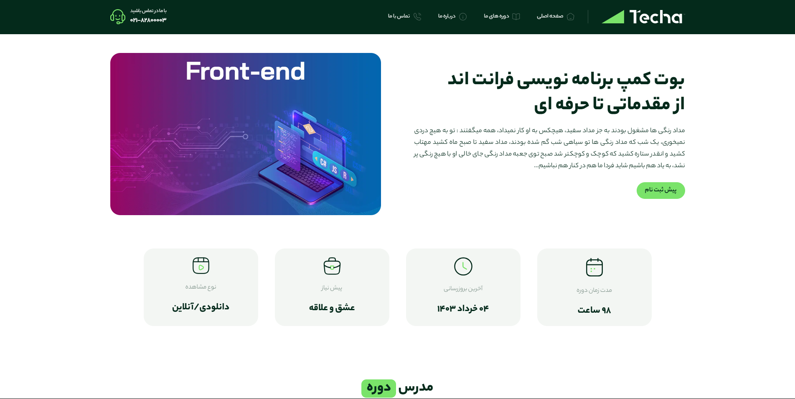

<div dir="rtl">

# 🚀 بوت‌کمپ فول‌استک تکا


**نسخه نمایشی زنده:** به‌زودی...

---

## ✨ ویژگی‌های پروژه

- **انیمیشن‌های حرفه‌ای** با استفاده از **Framer Motion**
- **طراحی مدرن و واکنش‌گرا** با بهره‌گیری از **Tailwind CSS**
- **بهینه‌سازی برای SEO** و عملکرد بالا
- افکت‌های بصری جذاب مانند **پارتیکل‌ها** و **گرادیانت‌های پویا**
- **رندر سمت سرور** با **Next.js** برای بهبود سرعت بارگذاری صفحات
- استفاده از **TypeScript** برای افزایش قابلیت اطمینان و نگهداری کد

---

## 🛠 فناوری‌های استفاده‌شده

| بخش         | تکنولوژی‌ها       |
| ----------- | ----------------- |
| فریمورک     | Next.js 14        |
| زبان        | TypeScript        |
| استایل‌دهی  | Tailwind CSS      |
| انیمیشن     | Framer Motion     |
| مدیریت حالت | React Context API |

---

## 📸 پیش‌نمایش

<div align="center">




</div>

---

## 🚀 اجرای پروژه

برای راه‌اندازی پروژه به صورت محلی، مراحل زیر را دنبال کنید:

1. **کلون کردن مخزن:**
   ```bash
   git clone https://github.com/YourUsername/YourPrivateRepo.git
   ```

## 🚀 اجرای پروژه

برای راه‌اندازی پروژه به صورت محلی، مراحل زیر را دنبال کنید:

1. **کلون کردن مخزن:**
   ```bash
   git clone https://github.com/YourUsername/YourPrivateRepo.git
   ```

````

> **توجه:** این مخزن خصوصی است و دسترسی به آن محدود می‌باشد.

2. **نصب وابستگی‌ها:**
   ```bash
   npm install
   ```
3. **اجرای سرور توسعه:**
   ```bash
   npm run dev
   ```
4. **مشاهده پروژه در مرورگر:**
   به آدرس `http://localhost:3000` مراجعه کنید.

---

## 📝 مشارکت

از آنجایی که پروژه خصوصی است، برای مشارکت لطفاً با مدیر پروژه تماس بگیرید و دسترسی‌های لازم را دریافت کنید.

مراحل کلی مشارکت:

1. **ایجاد برنچ جدید:**
   ```bash
   git checkout -b feature/feature-name
   ```
2. **اعمال تغییرات و کامیت‌ها:**
   ```bash
   git commit -m 'feat: توضیح ویژگی جدید'
   ```
3. **پوش کردن برنچ:**
   ```bash
   git push origin feature/feature-name
   ```
4. **ارسال درخواست Pull Request** و انجام بررسی‌های لازم

---

## ☁️ استقرار

پروژه به صورت خصوصی در محیط مورد نظر (مانند Vercel، Heroku یا سرور اختصاصی) استقرار یافته است.

---

## 📜 لایسنس

این پروژه تحت مجوز [MIT](./LICENSE) منتشر شده است.

---

<div align="center">

### ساخته‌شده با ❤️ توسط تیم تکا

</div>

</div>
```

---

### نکات:

- تصاویر `screenshot1.png` و `screenshot2.png` را در مسیر `public/images/` قرار دهید.
- تمام لینک‌های مخزن را با آدرس پروژه خصوصی خود جایگزین کنید.
- برای افزودن اسکرین‌شات‌های بیشتر، تصاویر را در بخش پیش‌نمایش آپلود کنید. ✅

---

**توضیحات:**

- **بخش‌های به‌روزرسانی‌شده:**

  - **حذف لینک‌های عمومی:** چون پروژه عمومی نیست، لینک‌های مربوط به دموی زنده یا مخزن عمومی حذف یا با یادداشت مناسب به‌روزرسانی شده‌اند.
  - **بهبود فرمت و زیباسازی:** از المان‌های بصری مانند خط جداکننده (`---`)، استفاده از لوگوها و شیلدهای مربوط به فناوری‌ها، و ترتیب‌دهی مناسب بخش‌ها برای افزایش خوانایی.

- **توجه به خصوصی بودن پروژه:** در بخش‌هایی که به عمومی بودن پروژه اشاره شده بود، توضیحات مناسب برای پروژه خصوصی داده شده است.

- **اضافه کردن فناوری‌های بیشتر:** در جدول فناوری‌ها، بخش‌های بیشتری مانند مدیریت حالت اضافه شده است.

---

اگر نیاز به تغییرات بیشتری دارید یا بخش خاصی نیاز به ویرایش دارد، لطفاً اطلاع دهید تا آن را به‌روزرسانی کنم. 🌟
````
